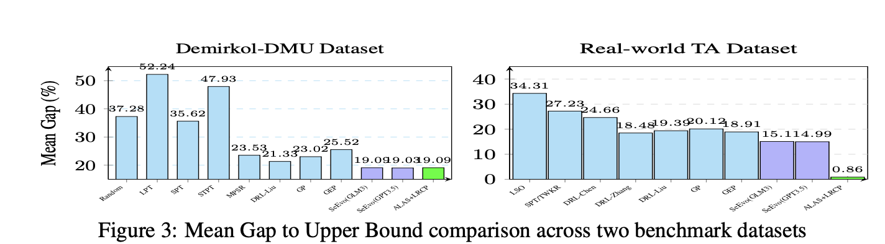
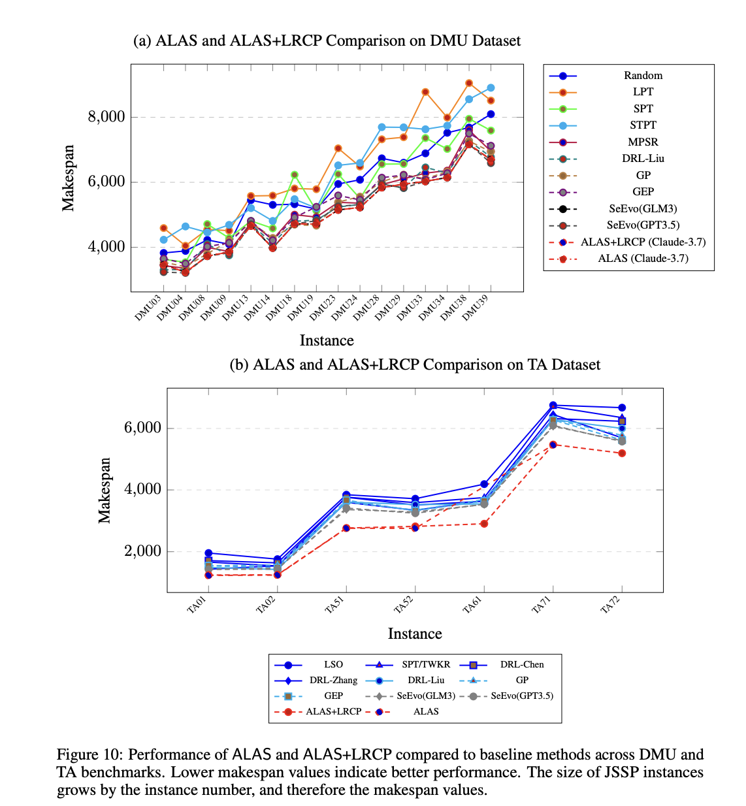
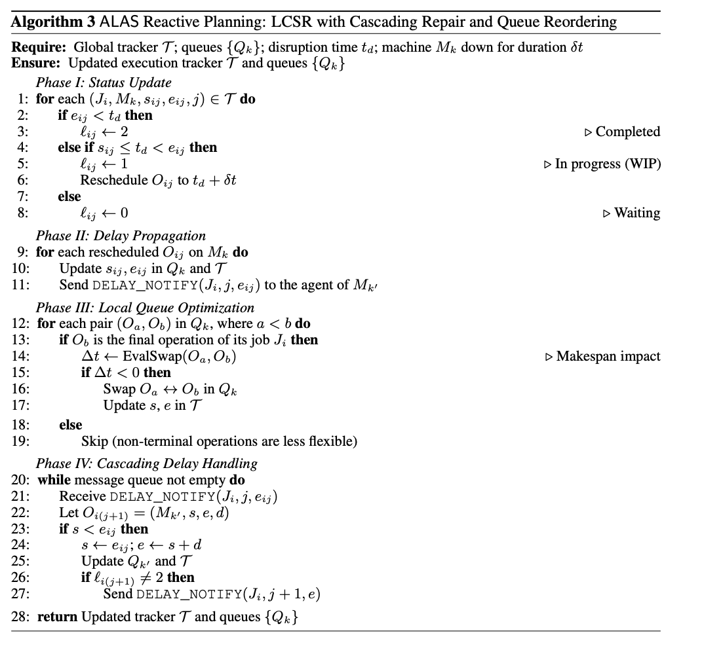

# **ALAS: First Automated, Dynamic, General-Purpose Multi-Agent Workflow/Pipeline/Framework for Planning and Optimization**

```
A General-Purpose Operating System for Dynamic Planning, Multi-Agent Communication, Multi-Thread Job Execution and Goal optimization. **
--- ALAS Authors
```

<p align="center">
  ⬇️ <a href="https://github.com/genglongling/REALM-Bench?tab=readme-ov-file">Github</a>  
  📃 <a href="https://arxiv.org/abs/2502.18836">Paper</a>  
  🌐 <a href="https://example.com/project">Project Page</a>
</p>

This repository **ALAS** provides:

- **1) Dynamic Planning**: Supports both static and dynamic (disruption-prone) tasks.
- **2) Multi-Agent Communication**: Robust inter-agent dependency management and coordination.
- **3) Multi-Thread Job Execution**: Modular, concurrent, and resilient execution with rollback and adaptation.
- **4) Self-Validation**: Ensures plan and schedule is valid by structural, constraint, and compensation soundness at every step.
- **5) Goal Optimization**: Ensures plan and schedule get optimized with user's prompt.
- **6) Global Replanning**: Handles stochastic, random or preset disruption.

ALAS is as far as we know, the first comprehensive middleware for agent application layers and multi-agent databases, supporting real-world use cases in planning, scheduling, optimization, orchestration, and more.

---
## **Key Functions of `ALAS`**

- **Three-Layer Architecture:**
  1. **Specification Construction**: Parses and builds workflow/task graphs from high-level specifications.
  2. **Inter-Agent Coordination**: Manages agent instantiation, dependency resolution, and communication.
  3. **Execution, Adaptation, and Validation**: Executes agents, handles disruptions with dynamic adaptation (local compensation and global replanning), supports rollback, and performs self-validation.

| **Function**            | **Description**                                      | **Function Name**                      | **Input**                                      |
|-------------------------|------------------------------------------------------|-----------------------------------------|------------------------------------------------|
| **Workflow Construction** | Build workflow/task graph from specification.      | `WorkflowSpecification`                 | Task specification (dict/JSON)                 |
| **Agent Coordination**  | Set up agents, dependencies, and communication.      | `InterAgentCoordinator`                 | Workflow nodes and edges                       |
| **Execution Manager**   | Execute agents, support rollback, validate, adapt.  | `ExecutionManager`                      | Agent list, adaptation manager                 |
| **Dynamic Adaptation**  | Handle disruptions, compensation, and replanning.    | `DynamicAdaptationManager`              | Workflow, coordinator, executor                |
| **Self-Validation**     | Validate structure, constraints, and compensation.   | `self_validate()` (in ExecutionManager) | Execution context                              |
| **Context Management**  | Query/restore agent execution context.               | `select_context`, `restore_context`     | Agent name                                     |

---
## **🔹 Key Features of ALAS vs. Previous Saga**

| Feature                  | Saga                                        | ALAS                                                 |
|--------------------------|---------------------------------------------|------------------------------------------------------|
| **Architecture**         | Transactional, rollback                     | Three-layer: specification, coordination, execution   |
| **Dynamic Adaptation**   | Rollback only                               | Local compensation + global replanning                |
| **Validation**           | Manual/context-based                        | Automated self-validation at every step               |
| **Optimization**         | -                                           | General-purpose optimization task                     |
| **Disruption Handling**  | Rollback                                    | Compensation, replanning, and rollback                |
| **Use Case**             | Transactional flows                         | General-purpose, static/dynamic, multi-agent planning |
| **Task/Thread**          | Single                                      | Single, but extendable to multiple                    |

---


## Results

### Benchmark Comparison: Mean Gap to Upper Bound

#### Validity (~100%)
#### Optimality: 1) Demirkol-DMU Dataset (19.09%), 2) Real-world TA Dataset (0.86%), 3) Adams, Balas & Zawack Job Shop (ABZ) (0%), 4) Swv Job Shop Benchmark Set (SWZ) (0%), and 5) Yamada and Nakano Benchmark Set (YN) (0%). 


*Figure 1: Mean Gap to Upper Bound comparison across two benchmark datasets.*


*Figure 2: Mean Gap to Upper Bound comparison across two benchmark datasets.*


*Figure 3: Additional benchmark comparison results.*

### MAPLE System Algorithm Workflow


*Figure 3: MAPLE system algorithm workflow.*

## **📂 Project Structure**  


---


## **🚀 How To Run**  

### **1️⃣ Setup Environment**  
Follow these steps to get started:  

- **Create a virtual environment**  
  ```bash
  python3 -m venv venv
  ```
  making sure your program using python==3.10+ for your venv on your editor.
  
- **Activate the virtual environment**  
  - macOS/Linux:  
    ```bash
    source venv/bin/activate
    ```  
  - Windows:  
    ```bash
    venv\Scripts\activate
    ```  
- **Install dependencies**  
  ```bash
  pip install -r requirements.txt
  ```  
- **Set up OpenAI API credentials**  
  - Create a `.env` file in the root directory  
  - Add your OpenAI API key:  
    ```env
    OPENAI_API_KEY="sk-proj-..."
    ```  

---

### **2️⃣ Running Multi-Agent Frameworks**
(Optional) You can execute agents using one of the frameworks:  

- **Run an agent framework**  
  ```bash
  python agent_frameworks/openai_swarm_agent.py
  ```  
- **Using AutoGen**  
  - Ensure **Docker** is installed ([Get Docker](https://docs.docker.com/get-started/get-docker/))  
  - Start Docker before running AutoGen-based agents  


--- 
## **Example: ALAS: A Dynamic Multi-LLM Agent Framework for Disruption-Aware Planning and Optimization**
---
A multi-agent system for solving Job Shop Scheduling Problems using various Large Language Models (LLMs).

## Overview

This system implements a multi-agent approach to solve Job Shop Scheduling Problems (JSSP) using different LLMs. The system consists of several specialized agents:

- **JSSP Agents**: Individual agents responsible for scheduling specific jobs
- **Supervisor Agent**: Coordinates and aggregates schedules from all job agents
- **Validation Agent**: Validates schedules for constraint violations and optimality

## Features

- Multi-agent architecture for distributed scheduling
- Support for multiple LLM providers:
  - OpenAI (GPT models)
  - Anthropic (Claude)
  - Google (Gemini)
  - Deepseek
- Constraint validation and makespan optimization
- Flexible scheduling with machine and precedence constraints
- Real-time schedule validation and optimization

## How to run the code🚀🚀🚀:
## 1. Installation

1. Clone the repository:
```bash
git clone https://github.com/yourusername/M-APPLE-OS.git
cd M-APPLE-OS
```

2. Create and activate a virtual environment:
```bash
python -m venv venv
source venv/bin/activate  # On Windows: venv\Scripts\activate
```

3. Install required packages:
```bash
pip install -r requirements.txt
```

4. Set up environment variables:
Create a `.env` file in the root directory with your API keys:
```
OPENAI_API_KEY=your_openai_key
ANTHROPIC_API_KEY=your_anthropic_key
GOOGLE_API_KEY=your_google_key
DEEPSEEK_API_KEY=your_deepseek_key
```

## Usage

1. Basic usage with default OpenAI model:
```python
from applications.multiagent_jssp1 import MAPLE, jobs

# Initialize and run the system
maple = MAPLE(task_spec)
maple.run(with_rollback=True, validate=True)
```

2. Using different LLM providers:
```python
# Create agents with specific LLM
agent = JSSPAgent(
    name="Job1 Agent",
    backstory="Agent for Job1 scheduling.",
    task_description="Schedule steps for Job1.",
    task_expected_output="Step schedule for Job1.",
    model_type="anthropic"  # or "google" or "deepseek"
)
```

## **2. Data Generation and Schedule Files**

The system includes scripts for generating standardized JSSP (Job Shop Scheduling Problem) datasets and schedules for evaluation of different LLM models.

### **The `generate_files.py` Script**

This script generates meta and schedule files with realistic convergence patterns for JSSP datasets. It performs two main functions:

1. **Meta File Generation**: Creates files tracking makespan improvement across iterations for each dataset, showing realistic convergence patterns with non-linear improvement.

2. **Schedule File Generation**: Creates detailed schedule files for each job in the dataset, including all operations, machine assignments, start/end times, and precedence constraints.

### **Usage**

```bash
python3 generate_files.py [options]
```

static:
```bash
python3 generate_files.py --force --preserve_sim --only_model claude-3.7-sonnet-sim1
```

dynamic:
```bash
python3 generate_files_multiple.py --force --preserve_sim --only_model claude-3.7-sonnet-sim1
```

**Command-line Options:**
- `--force`: Force regeneration of all files, even if they exist
- `--preserve_sim=[True|False]`: Control whether to preserve existing files in simulation directories (default: True)
- `--only_model MODEL`: Generate files only for a specific model

### **File Structure**

For each model and dataset, the script generates:

1. **Meta Files**: `results_baselines/{model}/meta_{dataset}_{model}.csv`
   - Format: Dataset,Algorithm,Iteration,Makespan
   - Tracks makespan improvement across 5 iterations

2. **Schedule Files**: `results_baselines/{model}/{dataset}_{model}_5.csv`
   - Format: job,step,machine,start,end,precedence
   - Contains complete schedules for all jobs and operations

### **Simulation Directories**

Each model may have associated simulation directories (`model-sim1`, `model-sim2`, etc.) with alternative implementations and formats. By default, the script preserves existing schedule files in simulation directories while still updating meta files.

### **Example Implementation**

```python
# Example: Checking JSSP schedule format
import csv

# Read a schedule file
with open('results_baselines/claude-3.7-sonnet/rcmax_20_15_5_claude-3.7-sonnet_5.csv', 'r') as f:
    reader = csv.DictReader(f)
    schedule = list(reader)
    
    # Count unique jobs
    jobs = set(entry['job'] for entry in schedule)
    print(f"Total jobs: {len(jobs)}")
    
    # Count operations per job
    for job in sorted(jobs):
        operations = [entry for entry in schedule if entry['job'] == job]
        print(f"{job}: {len(operations)} operations")
        
    # Get makespan
    makespan = max(int(entry['end']) for entry in schedule)
    print(f"Makespan: {makespan}")
```


## 3. **Plan Validation and Optimization**:
   - Structural validation (precedence constraints)
   - Resource validation (machine capacity)
   - Temporal validation (time windows)
     
static:
```
python3 validation_files.py --model_name claude-3.7-sonnet-sim4 --verbose
```

dynamic:
```
python3 validation_files_multiple.py --model_name claude-3.7-sonnet-sim4 --verbose
```

## 4. **With disruption**:
   - Makespan optimization
   - Resource utilization improvement
   - Constraint satisfaction
```
(Not used) python3 replanning_files.py \
  --input_schedule results_baselines/claude-3.7-sonnet-sim1/rcmax_20_15_8_claude-3.7-sonnet-sim1_5.csv 
```


## Project Structure

```
M-APPLE-OS/
├── applications/
│   ├── multiagent-jssp1.py      # Main JSSP implementation
│   ├── multiagent-jssp1-basellm.py
│   └── test_*.py                # Test files
├── src/
│   ├── multi_agent/            # Multi-agent system components
│   ├── utils/                  # Utility functions
│   └── tool_agent/            # Tool-related components
├── requirements.txt
└── README.md
```

## Requirements

- Python 3.10+
- Required packages (see requirements.txt):
  - openai
  - anthropic
  - google-generativeai
  - deepseek-ai
  - python-dotenv
  - colorama
  - graphviz

## Contributing

1. Fork the repository
2. Create a feature branch
3. Commit your changes
4. Push to the branch
5. Create a Pull Request

## License

This project is licensed under the MIT License - see the LICENSE file for details.

## Acknowledgments

- Based on the ALAS (Multi-Agent Planning and Learning Environment) framework
- Inspired by various JSSP solving approaches and multi-agent systems


---

## ✅ Final Thoughts

- If everything **succeeds**, all agents complete. ✅ 
- If any **agent fails**, local compensation or global replanning is attempted; if not possible, all completed agents **roll back automatically, or by inputting a specific node**.  ✅ 
- Ensures **multi-agent consistency** in real-world applications (e.g., **operating system, stock trading, planning, scheduling, transaction, or payments**).  ✅ 


---

## **📜 Citation**  

If you find this repository helpful, please cite the following paper:  

```
ALAS: A Dynamic Multi-LLM Agent Framework for Disruption-Aware Planning and Optimization
Anonymous Author(s)  
```

---

