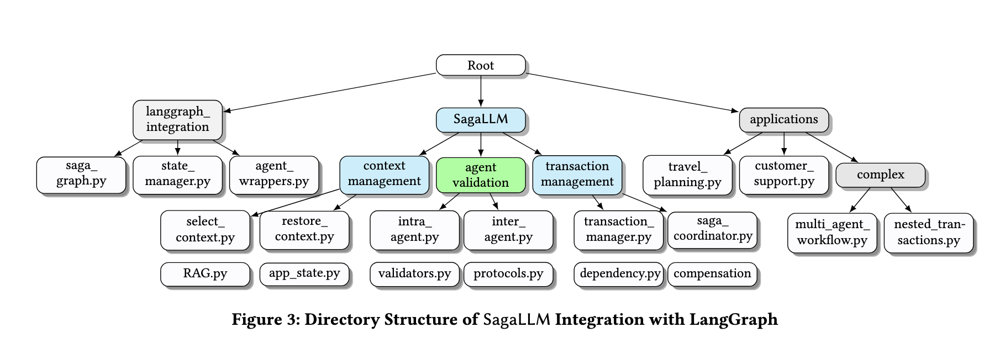

# **M-APPLE Agent OS: A General-Purpose Operating System for Dynamic Planning, Multi-Agent Communication, and Multi-Thread Execution**

```
What if LLM and Agent lost track of information? Reverting back as a transaction!

--- M-APPLE-OS Authors
```
<p align="center">
  ⬇️ <a href="https://github.com/genglongling/REALM-Bench?tab=readme-ov-file">Github</a>  
  📃 <a href="https://arxiv.org/abs/2502.18836">Paper</a>  
  🌐 <a href="https://example.com/project">Project Page</a>
</p>

This repository extends REALM-Bench with **M-APPLE-OS (MAPLE)**, a general-purpose, three-layer operating system for multi-agent planning, dynamic adaptation, and robust execution. M-APPLE-OS provides:

- **Dynamic Planning**: Supports both static and dynamic (disruption-prone) tasks.
- **Multi-Agent Communication**: Robust inter-agent dependency management and coordination.
- **Multi-Thread Execution**: Modular, concurrent, and resilient execution with rollback and adaptation.
- **Self-Validation**: Ensures structural, constraint, and compensation soundness at every step.

M-APPLE-OS is a comprehensive middleware for agent application layers and multi-agent databases, supporting real-world use cases in planning, scheduling, orchestration, and more.

---
## **Key Functions of `M-APPLE-OS (MAPLE)`**

- **Three-Layer Architecture:**
  1. **Specification Construction**: Parses and builds workflow/task graphs from high-level specifications.
  2. **Inter-Agent Coordination**: Manages agent instantiation, dependency resolution, and communication.
  3. **Execution, Adaptation, and Validation**: Executes agents, handles disruptions with dynamic adaptation (local compensation and global replanning), supports rollback, and performs self-validation.

| **Function**            | **Description**                                      | **Function Name**                      | **Input**                                      |
|-------------------------|------------------------------------------------------|-----------------------------------------|------------------------------------------------|
| **Workflow Construction** | Build workflow/task graph from specification.      | `WorkflowSpecification`                 | Task specification (dict/JSON)                 |
| **Agent Coordination**  | Set up agents, dependencies, and communication.      | `InterAgentCoordinator`                 | Workflow nodes and edges                       |
| **Execution Manager**   | Execute agents, support rollback, validate, adapt.  | `ExecutionManager`                      | Agent list, adaptation manager                 |
| **Dynamic Adaptation**  | Handle disruptions, compensation, and replanning.    | `DynamicAdaptationManager`              | Workflow, coordinator, executor                |
| **Self-Validation**     | Validate structure, constraints, and compensation.   | `self_validate()` (in ExecutionManager) | Execution context                              |
| **Context Management**  | Query/restore agent execution context.               | `select_context`, `restore_context`     | Agent name                                     |

---
## **🔹 Key Features of M-APPLE-OS (MAPLE) vs. Previous Saga**

| Feature                  | Saga                                        | M-APPLE-OS (MAPLE)                                   |
|--------------------------|---------------------------------------------|------------------------------------------------------|
| **Architecture**         | Transactional, rollback                     | Three-layer: specification, coordination, execution   |
| **Dynamic Adaptation**   | Rollback only                               | Local compensation + global replanning                |
| **Validation**           | Manual/context-based                        | Automated self-validation at every step               |
| **Disruption Handling**  | Rollback                                    | Compensation, replanning, and rollback                |
| **Use Case**             | Transactional flows                         | General-purpose, static/dynamic, multi-agent planning |

---
## **🚀 How To Run**  

### **1️⃣ Setup Environment**  
Follow these steps to get started:  

- **Create a virtual environment**  
  ```bash
  python3 -m venv venv
  ```
  making sure your program using python==3.10+ for your venv on your editor.
  
- **Activate the virtual environment**  
  - macOS/Linux:  
    ```bash
    source venv/bin/activate
    ```  
  - Windows:  
    ```bash
    venv\Scripts\activate
    ```  
- **Install dependencies**  
  ```bash
  pip install -r requirements.txt
  ```  
- **Set up OpenAI API credentials**  
  - Create a `.env` file in the root directory  
  - Add your OpenAI API key:  
    ```env
    OPENAI_API_KEY="sk-proj-..."
    ```  

---

### **2️⃣ Running Multi-Agent Frameworks**
(Optional) You can execute agents using one of the frameworks:  

- **Run an agent framework**  
  ```bash
  python agent_frameworks/openai_swarm_agent.py
  ```  
- **Using AutoGen**  
  - Ensure **Docker** is installed ([Get Docker](https://docs.docker.com/get-started/get-docker/))  
  - Start Docker before running AutoGen-based agents  

---
### **3️⃣ Import M-APPLE-OS (MAPLE) Library**
You can execute planning and adaptation using MAPLE:

  ```
  cd applications
  python3 multiagent-p5.py
  python3 multiagent-p6.py
  python3 multiagent-p8.py
  python3 multiagent-p9.py
  ```

and edit the "multiagent-p5.py" following the below coding format.

--- 
## **Examples**

(Keep the examples as in the original README, but update any references from `Saga` to `MAPLE` and from `saga` to `maple` in the code snippets. The rest of the example content and outputs remain unchanged.)

---
## ✅ Final Thoughts

- If everything **succeeds**, all agents complete. ✅ 
- If any **agent fails**, local compensation or global replanning is attempted; if not possible, all completed agents **roll back automatically, or by inputting a specific node**.  ✅ 
- Ensures **multi-agent consistency** in real-world applications (e.g., **stock trading, planning, scheduling, transaction, or payments**).  ✅ 

---

## **📂 Project Structure**  


---

## **📜 Citation**  

If you find this repository helpful, please cite the following paper:  

```
M-APPLE Agent OS: A General-Purpose Operating System for Dynamic Planning, Multi-Agent Communication, and Multi-Thread Execution
Anonymous Author(s)
```

---

